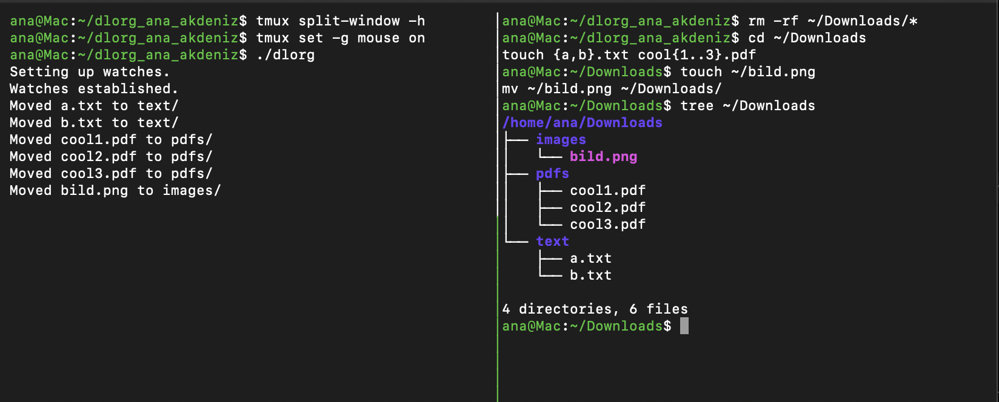
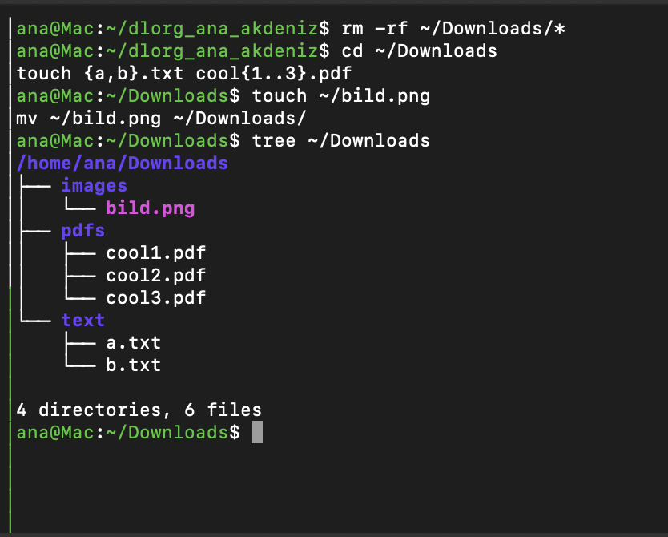

# dlorg – Downloads organizer

`dlorg` is a bash script that watches `~/Downloads` and automatically moves new files into folders based on their file extension (for example `.pdf` → `pdfs/`, `.png` → `images/`, unknown → `other/`).

It uses `inotifywait` to react when a file is created or moved into the folder, a `case` statement to choose the folder, and `mkdir -p` + `mv` to move the file.

## Get started

Requires inotify-tools (on Oracle Linux, install EPEL first):

```bash
sudo dnf install oracle-epel-release-el10
sudo dnf install inotify-tools
```

```bash
git clone git@github.com:anaakdeniz/dlorg_ana_akdeniz.git
cd dlorg_ana_akdeniz
./dlorg
```

Stop the script with `Ctrl+C`.

## Testing

Script running in the left tmux pane, files created and moved in the right pane:





## Use of AI

I used Claude as a sounding board to understand `inotifywait`, troubleshoot typos and the inotify-tools installation, and get explanations of parts of the script.
